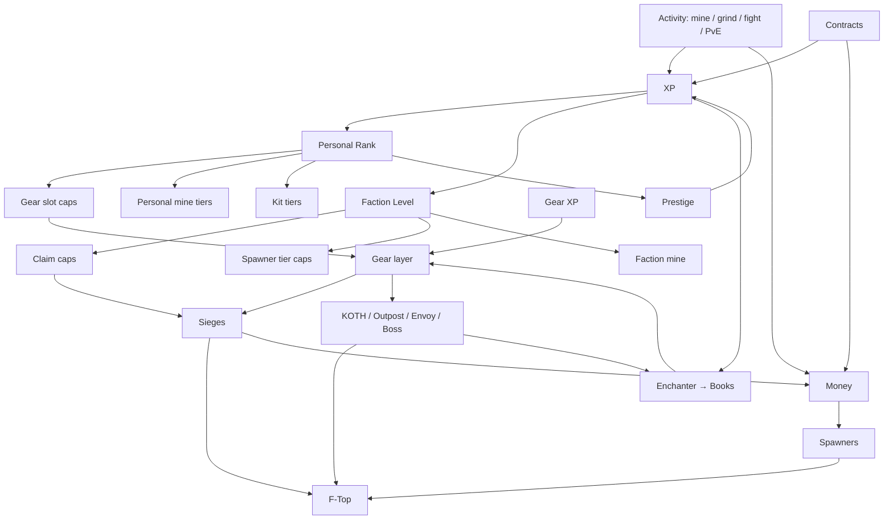

# Ascent Factions — Game Concept Document

*Working title. Version 0.1 — concept stage. All numbers are tunable defaults, not commitments.*

---

## 1. The pitch

**Ascent Factions is OP Factions with a prisons progression spine.** The team stakes, enchant lottery, god-set building, and raid drama of 2016-era factions — rebuilt so that every login produces progress nobody can take from you, and the things that *can* be taken are bounded, scheduled, and recoverable.

One sentence for players: *"Your rank is yours forever. Your faction's empire is up for grabs — but only when you're online to fight for it."*

## 2. Design pillars

1. **Personal progress is sacred.** A player's rank, prestige, and unlocks are never lost to a raid, a scam, or an inside job. Only the season reset touches them.
2. **Faction stakes are real but bounded.** You can lose a siege and it hurts. You cannot log in to an empty base at 7am.
3. **The lottery stays.** Book gambling, dust, scrolls, crates with published odds. Variable reward is the dopamine engine; we keep it and make it honest.
4. **Every playstyle feeds the team.** A miner who never fights still levels the faction. A fighter who never mines still funds it.
5. **Respect the clock.** A 20-minute session pays. A raid happens in a window the defender chose. A season lasts a month, not a quarter.
6. **Code over rulebook.** Every rule that Cosmic enforced with staff and screenshots is enforced by a plugin here.

## 3. The three-layer model

The core idea: split what players build into three layers with different risk profiles.

| Layer | What lives here | Who can take it | Resets when |
|---|---|---|---|
| **Personal** | Rank, prestige, personal mine tier, kit tier, cosmetics, contract history | Nobody | Season end (prestige carries) |
| **Faction** | Territory, spawners, faction vault, faction level, F-Top position | Other factions, via siege only | Season end |
| **Gear** | Armor/weapons, enchants, gear XP | Death (classic keep-inventory rules), destroy rolls | Season end |

Classic factions put everything on the faction layer, so one bad night erased weeks. Prisons put everything on the personal layer, so nothing was ever at stake. Ascent gives each layer its own job.

## 4. The core loop

### By timescale

**Session (15–30 min)**
Log in → check daily contracts → run your personal mine or a spawner cycle → spend XP on books → gamble one onto gear → grab an envoy if one's up. Result: rank XP, money, at least one lottery roll. Always.

**Day**
Complete the daily contract set → rank up once or twice → contribute to the faction quest → hit one event (KOTH, Outpost, boss). Result: personal ladder moves, faction level moves.

**Week**
Declare or defend a siege → faction level milestone unlocks a perk → F-Top shifts → weekly contract chain completes. Result: the faction's story advances.

**Season (4 weeks)**
Push prestige → chase F-Top payout → collect season cosmetics. Reset. Prestige count, titles, and a small permanent multiplier carry forward; everything else starts fresh.

### The engine underneath

```
Activity (mine / grind / fight / PvE)
   → XP + money
      → XP buys books (lottery) → gear gets stronger
      → XP fills personal rank → unlocks slots, tiers, kits
      → XP fills faction level → unlocks claims, spawner tiers, perks
      → money buys spawners → faction value → F-Top
   → stronger gear + higher faction level → win events & sieges
      → events & sieges drop books, dust, money → loop
```

The important property: **XP is the universal currency of progress**, and every activity produces it. That's what makes the personal ladder move regardless of playstyle.

## 5. Player archetypes and their tracks

Each archetype has a progression track that is satisfying on its own *and* feeds the faction.

| Archetype | What they do | Their track | How they feed the team |
|---|---|---|---|
| **Grinder** | Mines, spawner farms, sell runs | Personal mine tiers, spawner tech, rank ladder | Money → spawners → F-Top; XP → faction level |
| **Fighter** | KOTH, Outposts, Envoys, arena | Kill streaks, PvP leaderboard, fighter kit tiers | Event loot → books/dust into the faction vault |
| **Raider / Builder** | Siege planning, cannon tech, base design | Siege record, builder unlocks (claim shapes, regen tools) | Siege wins → vault loot; strong base → fewer losses |
| **Gambler** | Books, dust, scrolls, slot machine | Enchant collection, "perfect roll" milestones | Sells or gifts rolled books; builds god sets for fighters |
| **Collector** | Armor sets, pets, cosmetics, prestige badges | Set completion, prestige count, titles | Prestige multipliers boost their contribution; visible flex draws recruits |
| **Explorer** (PvE) | Dungeons, bosses, outer-ring zones | Dungeon tiers, boss kill records | Boss drops → books; ring resources → faction economy |

Design rule: **no archetype should ever need to switch lanes to keep progressing.** A pure grinder must be able to reach max rank; a pure fighter must be able to afford a god set.

---

## 6. Systems

Concept-level specs. Enough to see how the pieces fit; detailed numbers and lore text come in the PRD.

### 6.1 Personal Rank & Prestige

- **Rank 1–100.** XP curve is exponential-ish with a soft knee around rank 60 so the mid-game doesn't stall.
- **XP sources (all count):** mining blocks (by mine tier), spawner kills (melee only, classic rule), PvP kills (with diminishing returns per victim), event participation, dungeon clears, boss damage, contracts.
- **Unlocks by rank (examples):**
  - Enchant slot cap on gear: 6 base, +1 every 10 ranks (max 16 at rank 100; orbs can push it further)
  - Personal mine tier (see 6.7)
  - Personal kit tier (daily kit scales with rank — replaces the pay-only rank kit ladder)
  - Book cap at the Enchanter (higher tiers unlock as you rank — Legendary at ~rank 40)
  - Cosmetic unlocks, chat tag, nametag color
- **Prestige** at rank 100: rank resets to 1, player gains **+5% XP and +5% sell multiplier per prestige** (cap 50%), a prestige badge, and a cosmetic. Prestige count is the *only* progression that survives the season reset.
- **What it fixes:** the week-2 cliff. A raided player still has their rank, kit, mine tier, and a reason to log in.

### 6.2 Faction Level & Perks

- **Faction level 1–50**, fed by every member's XP at a fixed ratio (e.g., 20% of personal XP earned also goes to the faction).
- **Unlocks by level (examples):** claim count, spawner tier caps (can't place Tier 3 spawners until faction level 15), faction mine tier, `/f fly` in own claims, vault size, siege defense perks (regen speed), banner/rally abilities.
- **Faction quests:** daily and weekly objectives shared by all members ("mine 50k blocks", "win 2 KOTHs", "clear a Tier 3 dungeon") with rewards to the faction vault.
- **Why it matters:** a solo grinder's XP levels the faction. Team feeling without forcing everyone to PvP.

### 6.3 Gear: the lottery plus growth

- **Enchant lottery — unchanged from classic.** Enchanter sells unopened books for XP (Simple → Legendary). Books reveal into enchant + level + success% + destroy%. Apply is a single roll: success / fail-and-destroy / fail-and-survive. White Scrolls protect. Dust raises success. Black Scrolls extract. Randomization rerolls. Orbs add slots. Alchemist combines. Tinkerer recycles. (See the design bible for the full catalog.)
- **Gear XP (new).** Every piece of gear earns XP from kills dealt and damage taken while worn. Gear levels raise its slot cap by +1 per level (max +4), reduce durability loss slightly, and show a visible level tag in lore. A veteran set looks and *is* different.
- **Armor sets (later phase):** set crystals and specialty sets as in late-era Cosmic, layered on top.
- **Keep-inventory rules:** classic. Gear drops on death outside safezones. Holy White Scrolls exist for the pieces you can't afford to lose. This is deliberate — the gear layer is *supposed* to be at risk; it's what makes PvP matter.

### 6.4 Economy

- **Currencies:** money (shop, spawners, claims, AH), XP (books, rank, faction level), and in later phases souls for the Soul tier.
- **Money sources:** selling mine output (scaled by mine tier and prestige), spawner drops, contract payouts, event loot, siege loot, AH sales.
- **Money sinks:** spawners (the big one), claim upkeep (small daily cost per chunk — prevents dead-faction land hoarding), AH listing tax, siege declaration fee, cosmetic shop, Alchemist/Tinkerer fees.
- **F-Top value = spawner value + faction points.** Spawners give the classic "place value, defend it" tension. Faction points come from siege wins, event wins, and faction level, so a faction that fights well but places fewer spawners still ranks. Weekly payouts in store credit and cosmetics; no cash prizes (removes the alt-farm incentive).
- **Inflation control:** claim upkeep and AH tax scale with map age; spawner prices step up at faction-level thresholds.

### 6.5 Territory & Claims

- Classic chunk claiming with power, overclaiming, and roles/permissions — keep what worked.
- **Hard caps by faction level:** claim count, buffer depth (max chunks of buffer around the core), and base footprint. The rulebook's "buffer must be X" becomes a plugin limit.
- **Core claim** is the heart of the base and the siege objective.
- **Claim upkeep:** small daily cost; unpaid claims decay to wilderness after 3 days. Dead factions stop clogging the map.
- **New-faction shield:** 72 hours of siege immunity after creation (once per season per player to stop shield-hopping).
- **TNT and explosions in claims only function during an active siege on that claim.** Outside of sieges, claimed land is not raidable. Wilderness is always fair game.

### 6.6 Sieges (the raid rework)

This is the biggest departure from classic, and the one that makes the game playable for adults.

**Declare**

- An officer runs `/f siege declare <faction>`. Costs money scaled to the target's F-Top rank.
- Eligibility: target must be within a value band of the attacker (e.g., no less than 40% of the attacker's F-Top value) — prevents farming newcomers.
- Defender has pre-set **defense hours** (a daily 5-hour window, changeable once per week). The siege must land inside those hours, no sooner than 12h and no later than 48h from declaration. The plugin proposes slots; the attacker picks one.
- Both factions get in-game and Discord notifications. Countdown appears on the scoreboard.

**Prepare (until siege start)**

- Defender may patch, build, and reposition freely.
- Attacker builds cannons inside a designated **siege claim** adjacent to the target (temporary, granted by the declaration, removed after).
- Neither side may change claims around the core.

**Siege (60 minutes)**

- TNT works on the target's claims. Cannons are plugin-enforced: max walls per shot, max range, max TNT per second. No staff judgment calls.
- **Objective:** attacker places a Siege Flag in the target's core chunk and holds it for 3 minutes. Killing the flag carrier or breaking the flag resets the hold.
- Defenders get a small regen aura on core walls and a combat-log NPC for anyone who disconnects.
- Neither side can join or leave the faction during the siege.

**Resolve**

- **Attacker wins:** takes 25% of the target's vault money and 25% of placed spawners (chosen randomly, delivered as items to the attacker's vault), plus faction points. Target gets 24h immunity from that attacker.
- **Defender wins:** faction points, a share of the declaration fee, and 48h immunity from that attacker.
- **Either way:** blast damage in the target's claims is restored from a pre-siege snapshot. Bases are never wiped.

**Limits**

- A faction can be sieged at most twice per week and can declare at most one siege at a time.
- Alliances can't stack: only the declaring faction's members and the target's members can enter the siege zone.

**What it keeps:** cannon tech, the tension of a declared war, the loot, the leaderboard consequences.
**What it kills:** 3am offline raids, full-time patching, unlimited base loss, rule-lawyering, staff refereeing.

### 6.7 PvE lane

- **Personal mines.** Prisons-style tiered mines (Tier 1 stone → Tier 6+ exotic blocks), unlocked by personal rank, reset on a timer. Sell output scales with tier and prestige. Solo-safe (no PvP), instanced per player or small shared rooms.
- **Faction mine.** One per faction, tier tied to faction level, higher yield, members only. Can be a siege bonus objective in later phases.
- **Dungeons.** Instanced, party of up to 5, tiered to rank. Drops: books (tier scales with dungeon tier), dust, gear XP. A ~10–15 minute run — sized for a session.
- **World bosses.** Scheduled in the warzone, open PvP around them. Big book/dust drops split by damage contribution.
- **Spawners.** Classic: stacked, chunk-bound, virtual-yield (no live entity ticking), melee kills for XP. The F-Top backbone.

### 6.8 PvP lane

- **KOTH**, **Outposts**, **Envoys** as in classic Cosmic — fixed schedule, published in-game and on Discord. Outpost holders get a passive sell bonus for their faction.
- **Arena** at spawn for duels and ranked 1v1s (no gear loss, cosmetic rewards). A place for fighters to fight without the raid layer.
- **Kill streaks and bounties:** a bounty board where players and factions post money on heads; funds the fighter archetype directly.

### 6.9 Contracts (the daily loop)

- **Daily contracts:** 3 per day drawn from a pool that spans archetypes ("mine 5k blocks", "win an envoy", "apply 5 books", "clear a dungeon"). Rewards: XP, money, one book.
- **Weekly chain:** 7-step chain with a guaranteed Legendary book at the end.
- **Login calendar:** a modest 7-day reward track that resets weekly. No punishing streak mechanics — miss a day, lose nothing.

### 6.10 Map: concentric rings (Phase 3, optional)

- Spawn/warzone at the center. Rings outward increase PvE difficulty and resource richness: Ring 1 is safe-ish building land, Ring 3 has hostile mobs and rare ores, Ring 4 is boss territory.
- Factions that push outward earn more but defend more. Territory means something beyond "where my base is."
- Can be added to an existing flat map by zoning; doesn't need to be in the MVP.

### 6.11 Seasons

- **Length:** 4 weeks. Short enough that a lost siege isn't the end of the world; long enough for a story.
- **Carryover:** prestige count, titles, cosmetics, and the prestige multiplier. Nothing else.
- **Reset hype:** reveal next season's theme, new dungeon, and rule tweaks in the final week.

### 6.12 Monetization principles

- Ranks sell **convenience**, not siege power: homes, `/fix`, AH slots, kit cosmetics, XP boost caps.
- Crates have **published odds**, contain nothing exclusive to winning sieges, and scale with map age.
- No cash F-Top prizes. Store credit and cosmetics only.
- Everything a paying player can do, a free player can do slower.

---

## 7. Dependency map



Read it as: **XP is the hub.** Everything produces it; rank, faction level, and books consume it.

---

## 8. Build order

Aligned with the modern-Paper stack decision (Paper 1.21.x + OldCombatMechanics + Via + Grim/Vulcan).

**Phase 1 — Playable core (MVP)**
Personal rank ladder · Enchanter + book lottery (Simple→Legendary) + White Scroll + Magic Dust · Tinkerer · Alchemist · Personal mines (3 tiers) · Spawners (virtual yield, stacking) · Factions with claims/power/roles and claim upkeep · Spawner F-Top · Daily contracts · KOTH + Envoys · 1.8 combat via OCM · Combat-log NPC · Item ID tagging + transaction log from day one.

**Phase 2 — Stakes**
Sieges (full flow) · Faction level + perks + faction quests · New-faction shield · Outposts · World bosses · Dungeons (2 tiers) · Weekly contract chain · F-Top faction points + store-credit payouts · Bounty board.

**Phase 3 — Depth**
Prestige · Gear XP · Black/Randomization/Transmog scrolls + Orbs · Soul tier + Souls · Faction mine · Arena/duels · Higher mine and dungeon tiers · Concentric rings.

**Phase 4 — Late-era Cosmic layer**
Heroic and Mastery tiers · Armor sets and crystals · Masks · Trinkets · Pets · Seasonal events.

Rule for every phase: **closed beta with a dupe bounty before it goes live.**

---

## 9. Open design questions (to playtest, not to guess)

1. **Siege take rate.** Is 25% enough to make attacking worth it and losing survivable? Test 20/25/35.
2. **Defense hours.** 5 hours daily may be too narrow for factions spanning time zones; consider two 3-hour windows.
3. **Gear drop on death.** Classic full-drop vs. a softer "drop 1 random piece" for non-siege PvP. The purist answer is full-drop; the retention answer may not be.
4. **Faction XP ratio.** 20% contribution may make faction level too fast for large factions; may need a per-member cap.
5. **Prestige carryover.** 5% per prestige could compound into a real advantage for veterans by season 5. Consider a lower per-prestige value or a hard cap on the *effective* bonus.
6. **F-Top point weighting.** How much should siege/event points count vs. spawner value? If too high, spawners stop mattering; if too low, fighters stop caring about F-Top.
7. **Contract pool balance.** Make sure no archetype's daily set forces them into another lane.
8. **Personal vs. shared mines.** Instanced mines are cheaper and safer; shared mine rooms create chance encounters and recruiting. Test both.

---

## 10. Glossary

- **Personal layer / Faction layer / Gear layer** — the three risk tiers of player progress.
- **Rank** — personal 1–100 ladder; **Prestige** — reset at 100 for a permanent bonus.
- **Faction Level** — team ladder fed by member XP.
- **Siege** — the declared, scheduled, plugin-enforced replacement for open raiding.
- **Defense hours** — a faction's pre-set daily window in which sieges may occur.
- **Siege Flag** — the capture objective placed in the core chunk.
- **Core claim** — the faction's home chunk and siege objective.
- **Claim upkeep** — daily cost per chunk; unpaid claims decay.
- **Contracts** — daily/weekly quests spanning all archetypes.
- **Gear XP** — experience earned by equipment through use; raises slot cap.
- **Virtual yield** — spawner output computed server-side without ticking live mobs.
- **Book / success% / destroy%** — the enchant lottery (see design bible).
- **F-Top** — faction leaderboard by spawner value plus faction points.
